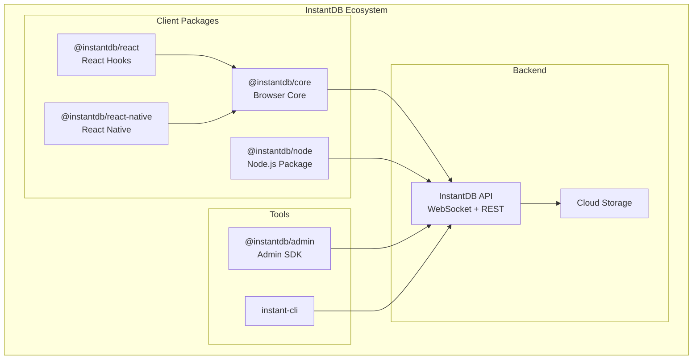
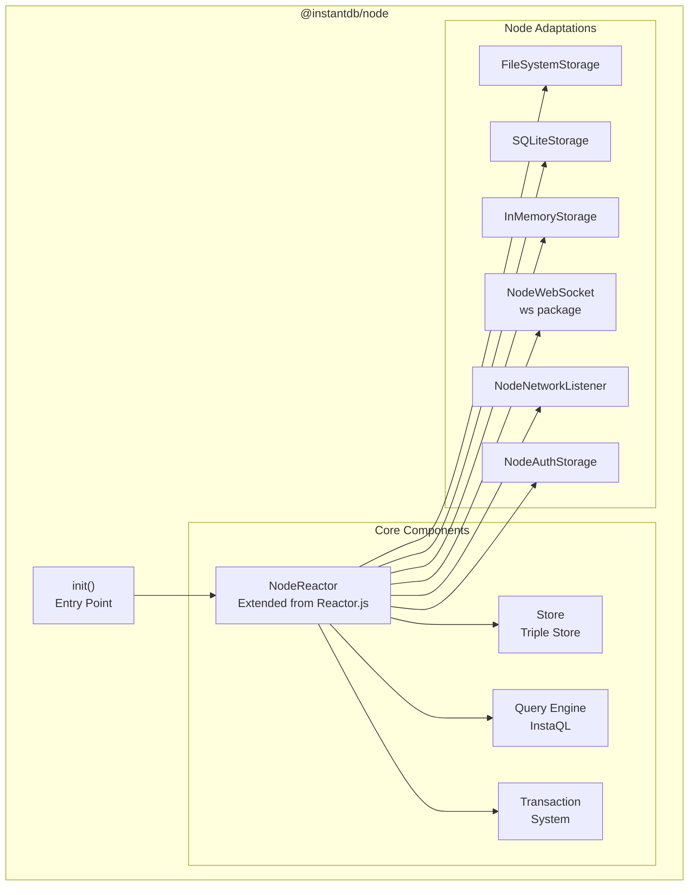
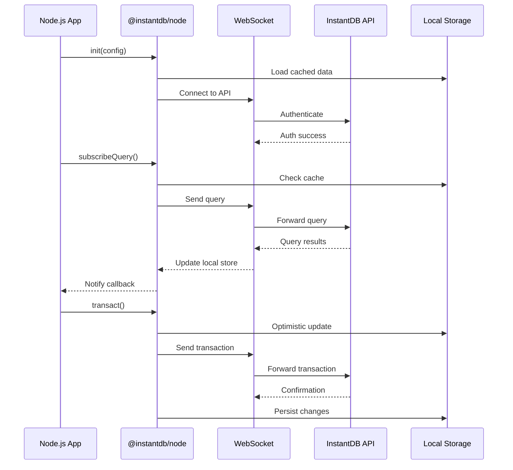

# InstantDB Node.js Package Architecture

## System Architecture Diagram

## Node.js Package Internal Architecture

## Data Flow Diagram

## Component Responsibilities

### Core Components (Reused from @instantdb/core)

1. **Reactor.js**
   - WebSocket connection management
   - Query subscription handling
   - Transaction processing
   - State synchronization

2. **Store.js**
   - Triple store implementation
   - Local data caching
   - Optimistic updates

3. **InstaQL**
   - Query parsing and execution
   - Datalog processing
   - Result formatting

### Node.js-Specific Components

1. **Storage Adapters**
   - **FileSystemStorage**: JSON files for development
   - **SQLiteStorage**: Production-ready persistent storage
   - **InMemoryStorage**: Testing and ephemeral use cases

2. **Network Components**
   - **NodeWebSocket**: Wrapper around 'ws' package
   - **NodeNetworkListener**: Network status monitoring

3. **Authentication**
   - **NodeAuthStorage**: Secure token storage using OS keychain or encrypted files

## Key Design Decisions

### 1. Storage Strategy
- Default to in-memory storage for simplicity
- Opt-in persistence with file system or SQLite
- Configurable storage path

### 2. Network Handling
- Assume always online for server environments
- Implement reconnection with exponential backoff
- Connection pooling for multiple instances

### 3. API Compatibility
- 100% API compatibility with @instantdb/core
- Same query syntax and transaction API
- Identical subscription callbacks

### 4. Performance Optimizations
- Lazy loading of storage backends
- Connection reuse across instances
- Efficient memory management for long-running processes

## Implementation Phases

### Phase 1: Core Infrastructure
- Package setup and build configuration
- Basic storage adapter interface
- Node.js WebSocket implementation

### Phase 2: Reactor Integration
- Extend Reactor for Node.js environment
- Implement storage adapters
- Network listener implementation

### Phase 3: Feature Parity
- Query and subscription system
- Transaction processing
- Authentication flow

### Phase 4: Optimization
- Performance tuning
- Memory leak prevention
- Connection pooling

### Phase 5: Testing & Documentation
- Comprehensive test suite
- API documentation
- Migration guides
- Example applications